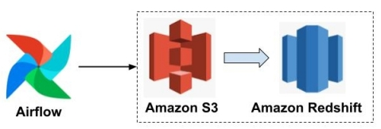
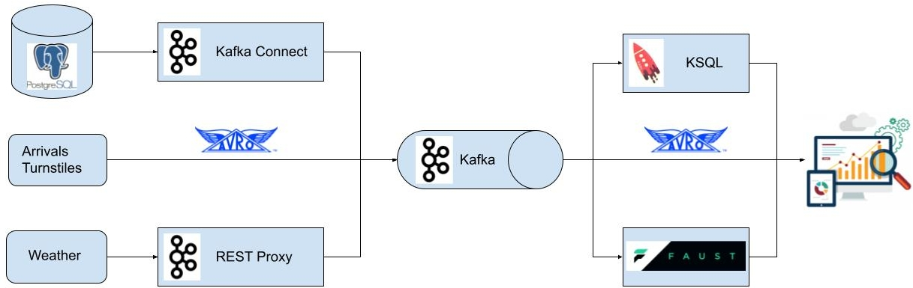

# Data Engineering

Jun Zhu

## Dev Environment Setup

- [Instruction](./dev_envs/spark_docker) of setting up a standalone Spark cluster 
  locally in Docker.
  
- [Instruction](./dev_envs/airflow_docker) of running Airflow in Docker.

- [Instruction](./dev_envs/kafka_docker) of running Kafka in Docker.

## Udacity Data Engineering Nanodegree

- [Data Modeling with postgreSQL](./data_modeling_with_postgres)
- [Data Modeling with Apache Cassandra](./data_modeling_with_apache_cassandra)
- [Data Warehouse with AWS Redshift](./data_warehouse_with_redshift)
  
  

- [Data Lake with Apache Spark](./data_lake_with_spark)
  
  

- [Data Pipeline with Apache Airflow](./data_pipeline_with_airflow)
  
  

- [Data Engineering Capstone Project](./dend_capstone_project)

  

## Udacity Data Streaming Nanodegree

- [Transit Status Tracker with Kafka](./transit_status_tracker_with_kafka)

  

- [STEDI app with Spark Streaming](./stedi_app_with_spark_streaming)

  
