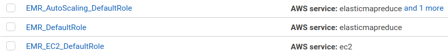

# Data Lake

Jun Zhu
___

A music streaming startup, Sparkify, has grown their user base and song database 
even more and want to move their data warehouse to a data lake. Their data 
resides in S3, in a directory of JSON logs on user activity on the app, as well 
as a directory with JSON metadata on the songs in their app.

As their data engineer, you are tasked with **building an ETL pipeline that 
extracts their data from S3, processes them using Spark, and loads the data 
back into S3 as a set of dimensional tables**. This will allow their analytics 
team to continue finding insights in what songs their users are listening to. 
You'll be able to test your database and ETL pipeline by running queries given 
to you by the analytics team from Sparkify and compare your results with their 
expected results.

## Datasets

- s3://udacity-dend/song_data
- s3://udacity-dend/log_data

### Song dataset

The first dataset is a subset of real data from the 
[Million Song Dataset](http://millionsongdataset.com/). Each file is in JSON 
format and contains metadata about a song and the artist of that song. The 
files are partitioned by the first three letters of each song's track ID. 
For example, here are filepaths to two files in this dataset.

```angular2html
song_data/A/B/C/TRABCEI128F424C983.json
song_data/A/A/B/TRAABJL12903CDCF1A.json
```

### Log dataset

The second dataset consists of log files in JSON format generated by this 
event simulator based on the songs in the dataset above. These simulate 
activity logs from a music streaming app based on specified configurations.

The log files in the dataset you'll be working with are partitioned by year 
and month. For example, here are filepaths to two files in this dataset.

```angular2html
log_data/2018/11/2018-11-12-events.json
log_data/2018/11/2018-11-13-events.json
```


## Schema for song play analysis

A star schema is employed to facilitate queries on song play analysis.

### Fact table

- **songplays** - records in log data associated with song plays, i.e. 
  records with page NextSong.
  
  Columns: *songplay_id*, *start_time*, *user_id*, *level*, 
  *song_id*, *artist_id*, *session_id*, *location*, *user_agent*

### Dimension tables

- **users** - users in the app.
  
  Columns: *user_id*, *first_name*, *last_name*, *gender*, *level*
- **songs** - songs in music database.
  
  Columns: *song_id*, *title*, *artist_id*, *year*, *duration*
- **artists** - artists in music database.
  
  Columns: *artist_id*, *name*, *location*, *latitude*, *longitude*
- **time** - timestamps of records in songplays broken down into specific units. 
  
  Columns: *start_time*, *hour*, *day*, *week*, *month*, *year*, *weekday*

## Installing dependencies

### Install AWS CLI v2

[Instruction](https://docs.aws.amazon.com/cli/latest/userguide/install-cliv2.html)

## Getting started

We will run the ETL pipeline on Amazon Elastic MapReduce (Amazon EMR).
Amazon EMR is the industry-leading cloud big data platform for processing vast 
amounts of data using open source tools such as Apache Spark, Apache Hive, 
Apache HBase, Apache Flink, Apache Hudi, and Presto. Amazon EMR makes it easy 
to set up, operate, and scale your big data environments by automating 
time-consuming tasks like provisioning capacity and tuning clusters. With EMR 
you can run petabyte-scale analysis at less than half of the cost of 
traditional on-premises solutions and over 3x faster than standard Apache 
Spark. You can run workloads on Amazon EC2 instances, on Amazon Elastic 
Kubernetes Service (EKS) clusters, or on-premises using EMR on AWS Outposts.

- Create default roles in IAM.
```sh
aws emr create-default-roles
```


- Start an EMR cluster 
```sh
aws emr create-cluster --release-label emr-5.28.0 \
                       --instance-count 3 \
                       --name data-lake-emr \
                       --use-default-roles \
                       --applications Name=Spark \
                       --instance-type m5.xlarge \
                       --ec2-attributes KeyName=<your permission key name>
                       
# optional
aws emr describe-cluster --cluster-id <ClusterId>
```

- Modify the security group

```sh
# Show EMR security group names and IDs.
aws ec2 describe-security-groups --filters Name=group-name,Values="ElasticMapReduce-*" \
                                 --query "SecurityGroups[*].{Name:GroupName,ID:GroupId}"
```

- Run the ETL pipeline
```sh
python etl.py
```

- Terminate the EMR cluster
```sh
aws emr list-clusters --active
aws emr terminate-clusters --cluster-ids <ClusterId>
```
