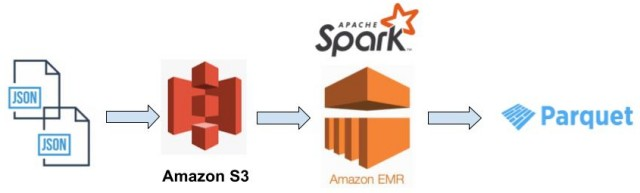
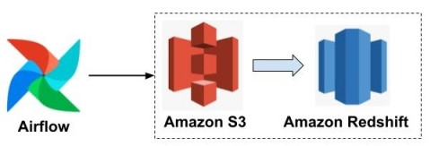

- [Data Modeling with postgreSQL](./data_modeling_with_postgres)
- [Data Modeling with Apache Cassandra](./data_modeling_with_apache_cassandra)
- [Data Warehouse with AWS Redshift](./data_warehouse_with_redshift)
  
  

- [Data Lake with Apache Spark](./data_lake_with_spark)
  
  

- [Data Pipeline with Apache Airflow](./data_pipeline_with_airflow)
  
  

- [Data Engineering Capstone Project](./dend_capstone_project)

  