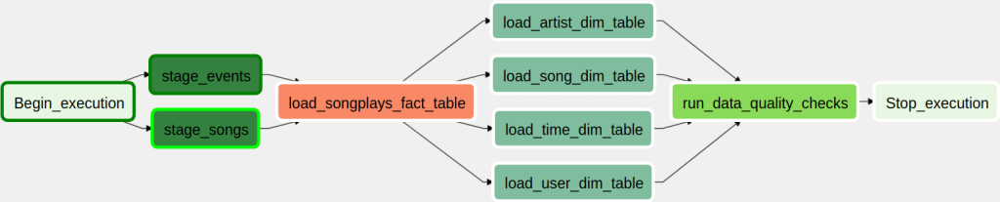

# Data Pipeline with Apache Airflow

Jun Zhu
___


A music streaming company, Sparkify, has decided that it is time to introduce 
more automation and monitoring to their data warehouse ETL pipelines and come 
to the conclusion that the best tool to achieve this is Apache Airflow.

They have decided to bring you into the project and expect you to **create high 
grade data pipelines that are dynamic and built from reusable tasks, can be 
monitored, and allow easy backfills**. They have also noted that the data quality 
plays a big part when analyses are executed on top the data warehouse and want 
to **run tests against their datasets after the ETL steps have been executed to 
catch any discrepancies in the datasets**.

The source data resides in S3 and needs to be processed in Sparkify's data 
warehouse in Amazon Redshift. The source datasets consist of JSON logs that 
tell about user activity in the application and JSON metadata about the songs 
the users listen to.

## Datasets

- s3://udacity-dend/song_data
- s3://udacity-dend/log_data (s3://udacity-dend/log_json_path.json)

## Getting started

### Start an AWS Redshift cluster

One can make use of the script in the project 
[data_warehouse_with_redshift](../data_warehouse_with_redshift).

### Create tables

Create tables by copying all the queries in the file 
[create_tables.sql](./create_tables.sql)
into the `Redshift query editor` in the AWS web console.

### Running Apache Airflow in Docker

Copy the [Docker Compose file](../../dev_envs/airflow_docker/docker-compose.yaml)
to the current directory and start Airflow server by
```sh
docker-compose up
```

### Login to the web UI of Airflow at http://localhost:8080

Create two connections `aws_credentials` and `redshift` by following the steps 
in `aws_s3_to_redshift.py` and `connections_and_hooks.py` 
[here](../../dev_envs/airflow_docker/dags), respectively.

### Run the DAG



Results from the quality check operator:

```
AIRFLOW_CTX_DAG_OWNER=sparkify
AIRFLOW_CTX_DAG_ID=sparkify_pipeline
AIRFLOW_CTX_TASK_ID=run_data_quality_checks
AIRFLOW_CTX_EXECUTION_DATE=2019-01-12T00:00:00+00:00
AIRFLOW_CTX_DAG_RUN_ID=scheduled__2019-01-12T00:00:00+00:00
[2021-04-22 20:18:41,539] {data_quality.py:26} INFO - Checking data quality for table 'songs'
[2021-04-22 20:18:41,546] {base.py:74} INFO - Using connection to: id: redshift. Host: dwh-cluster.cqoipzj7r5ft.us-west-2.redshift.amazonaws.com, Port: 5439, Schema: sparkify-dwh, Login: student, Password: XXXXXXXX, extra: None
[2021-04-22 20:18:44,707] {data_quality.py:35} INFO - Data quality check on table 'songs' passed with 18520 records
[2021-04-22 20:18:44,707] {data_quality.py:26} INFO - Checking data quality for table 'time'
[2021-04-22 20:18:44,729] {base.py:74} INFO - Using connection to: id: redshift. Host: dwh-cluster.cqoipzj7r5ft.us-west-2.redshift.amazonaws.com, Port: 5439, Schema: sparkify-dwh, Login: student, Password: XXXXXXXX, extra: None
[2021-04-22 20:18:47,985] {data_quality.py:35} INFO - Data quality check on table 'time' passed with 20460 records
[2021-04-22 20:18:47,985] {data_quality.py:26} INFO - Checking data quality for table 'users'
[2021-04-22 20:18:47,992] {base.py:74} INFO - Using connection to: id: redshift. Host: dwh-cluster.cqoipzj7r5ft.us-west-2.redshift.amazonaws.com, Port: 5439, Schema: sparkify-dwh, Login: student, Password: XXXXXXXX, extra: None
[2021-04-22 20:18:51,669] {data_quality.py:35} INFO - Data quality check on table 'users' passed with 312 records
[2021-04-22 20:18:51,669] {data_quality.py:26} INFO - Checking data quality for table 'artists'
[2021-04-22 20:18:51,675] {base.py:74} INFO - Using connection to: id: redshift. Host: dwh-cluster.cqoipzj7r5ft.us-west-2.redshift.amazonaws.com, Port: 5439, Schema: sparkify-dwh, Login: student, Password: XXXXXXXX, extra: None
[2021-04-22 20:18:55,356] {data_quality.py:35} INFO - Data quality check on table 'artists' passed with 13571 records
[2021-04-22 20:18:55,356] {data_quality.py:26} INFO - Checking data quality for table 'songplays'
[2021-04-22 20:18:55,364] {base.py:74} INFO - Using connection to: id: redshift. Host: dwh-cluster.cqoipzj7r5ft.us-west-2.redshift.amazonaws.com, Port: 5439, Schema: sparkify-dwh, Login: student, Password: XXXXXXXX, extra: None
[2021-04-22 20:18:58,836] {data_quality.py:35} INFO - Data quality check on table 'songplays' passed with 13640 records
[2021-04-22 20:18:58,849] {taskinstance.py:1166} INFO - Marking task as SUCCESS. dag_id=sparkify_pipeline, task_id=run_data_quality_checks, execution_date=20190112T000000, start_date=20210422T201841, end_date=20210422T201858
[2021-04-22 20:18:58,886] {taskinstance.py:1220} INFO - 1 downstream tasks scheduled from follow-on schedule check
[2021-04-22 20:18:58,914] {local_task_job.py:146} INFO - Task exited with return code 0

```
