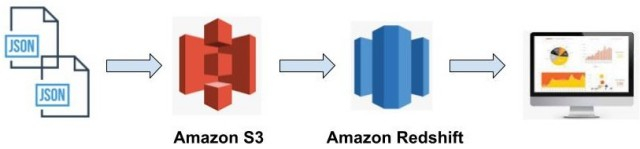

# DEND - Data Warehouse with Amazon Redshift

Jun Zhu
___



A music streaming startup, Sparkify, has grown their user base and song database 
and want to move their processes and data onto the cloud. Their data resides in 
S3, in a directory of JSON logs on user activity on the app, as well as a 
directory with JSON metadata on the songs in their app.

As their data engineer, you are tasked with **building an ETL pipeline that 
extracts their data from S3, stages them in Redshift, and transforms data into 
a set of dimensional tables** for their analytics team to continue finding 
insights in what songs their users are listening to. You'll be able to test 
your database and ETL pipeline by running queries given to you by the analytics 
team from Sparkify and compare your results with their expected results.

## Datasets

- s3://udacity-dend/song_data
- s3://udacity-dend/log_data

### Song dataset

The first dataset is a subset of real data from the 
[Million Song Dataset](http://millionsongdataset.com/). Each file is in JSON 
format and contains metadata about a song and the artist of that song. The 
files are partitioned by the first three letters of each song's track ID. 
For example, here are filepaths to two files in this dataset.

```sh
song_data/A/A/A/TRAAAAK128F9318786.json
song_data/A/B/R/TRABRLW128F930321D.json
```

There are xxx JSON files and 385252 records in total.

### Log dataset

The second dataset consists of log files in JSON format generated by this 
event simulator based on the songs in the dataset above. These simulate 
activity logs from a music streaming app based on specified configurations.

The log files in the dataset you'll be working with are partitioned by year 
and month. For example, here are filepaths to two files in this dataset.

```sh
log_data/2018/11/2018-11-01-events.json
log_data/2018/11/2018-11-30-events.json
```

There are 30 JSON files and 8056 records in total.

For more details about the above two datasets, please check this 
[notebook](../data_modeling_with_postgres/etl.ipynb).

## Schema for song play analysis

A star schema is employed to facilitate queries on song play analysis.

### Fact table

- **songplays** - records in log data associated with song plays, i.e. 
  records with page NextSong.
  
  Columns: *songplay_id*, *start_time*, *user_id*, *level*, 
  *song_id*, *artist_id*, *session_id*, *location*, *user_agent*

### Dimension tables

- **users** - users in the app.
  
  Columns: *user_id*, *first_name*, *last_name*, *gender*, *level*
- **songs** - songs in music database.
  
  Columns: *song_id*, *title*, *artist_id*, *year*, *duration*
- **artists** - artists in music database.
  
  Columns: *artist_id*, *name*, *location*, *latitude*, *longitude*
- **time** - timestamps of records in songplays broken down into specific units. 
  
  Columns: *start_time*, *hour*, *day*, *week*, *month*, *year*, *weekday*

## Installing dependencies

### Boto3 (AWS SDK for Python)

[Documentation](https://boto3.amazonaws.com/v1/documentation/api/latest/index.html)

```
pip install boto3
```

## Getting started

First, create an IAM role named `RedshiftRole` for Redshift with the policy 
`AmazonS3ReadOnlyAccess` in the AWS management console.

Start a Redshift cluster 
```sh
python run_on_aws.py
```

Print a summary of data on S3 (optional)
```sh
python summarize_data.py
```

Initialize all tables
```sh
python create_tables.py
```

Run the ETL pipeline
```sh
python etl.py
```

Be patient! It took about three and a half hours to copy the data from S3 
into the staging tables in Redshift.

**Caveats in this step:**
- The `timestamp` is in millisecond;
- The lengths of `artist_location`, `artist_name` and `title` in the Song dataset 
  can be longer than the default length (256) of `varchar`, which results 
  in `std_load_errors`.


Example query result:
```sh
Number of rows in the staging events table:  8056
Number of rows in the staging songs table:  385252
Query result of song table:
 -  (384824,)
 -  ('SOPDWEJ12AB018BC6D', 'Spite', 'ARBBHDX1187B9B2EE7', 1992, Decimal('271'))
 -  ('SODNDRW12A6D4F98CD', 'Everything Is Alright (album version)', 'AR50H061187FB4AE1C', 2006, Decimal('193'))
 -  ('SOFMIWT12A8C141EE3', 'Heiliges Herz (Thomas Rainer - Remix)', 'AR1SQV21187B9AE9C6', 0, Decimal('290'))
 -  ('SOABWAP12A8C13F82A', 'Take Time', 'AR5LMPY1187FB573FE', 1978, Decimal('258'))
 -  ('SOLOOSA12AC4688A3C', 'Corazon Partio Club Mix Edit', 'ARQATCR1187FB4D3E6', 0, Decimal('270'))
Query result of artist table:
 -  (45266,)
 -  ('AR1RHCO1187B9AF0BF', 'Vince Guaraldi / Bola Sete', 'San Francisco, CA', Decimal('37'), Decimal('-122'))
 -  ('ARIRDVY1187FB587CC', 'The Beautiful Girls', 'Sydney, New South Wales, Australi', Decimal('-33'), Decimal('151'))
 -  ('ARLTWXK1187FB5A3F8', 'King Curtis', 'Fort Worth, TX', Decimal('32'), Decimal('-97'))
 -  ('ARDWGXO1187FB5BFD6', 'Ian Siegal', '', None, None)
 -  ('AR7RUDQ1187B98C147', 'Alabama Thunderpussy', '', None, None)
Query result of time table:
 -  (6813,)
 -  (datetime.datetime(2018, 11, 3, 1, 5, 50, 796000), 1, 3, 44, 11, 2018, 6)
 -  (datetime.datetime(2018, 11, 3, 14, 17, 50, 796000), 14, 3, 44, 11, 2018, 6)
 -  (datetime.datetime(2018, 11, 3, 15, 54, 48, 796000), 15, 3, 44, 11, 2018, 6)
 -  (datetime.datetime(2018, 11, 3, 16, 10, 32, 796000), 16, 3, 44, 11, 2018, 6)
 -  (datetime.datetime(2018, 11, 3, 16, 29, 46, 796000), 16, 3, 44, 11, 2018, 6)
Query result of user table:
 -  (105,)
 -  (53, 'Celeste', 'Williams', 'F', 'free')
 -  (95, 'Sara', 'Johnson', 'F', 'paid')
 -  (49, 'Chloe', 'Cuevas', 'F', 'free')
 -  (8, 'Kaylee', 'Summers', 'F', 'free')
 -  (14, 'Theodore', 'Harris', 'M', 'free')
Query result of songplay table:
 -  (7268,)
 -  (8, datetime.datetime(2018, 11, 29, 21, 0, 3, 796000), 80, 'paid', 'SOXQYSC12A6310E908', 'AR0L04E1187B9AE90C', 1065, 'Portland-South Portland, ME', '"Mozilla/5.0 (Macintosh; Intel Mac OS X 10_9_4) AppleWebKit/537.36 (KHTML, like Gecko) Chrome/36.0.1985.143 Safari/537.36"')
 -  (24, datetime.datetime(2018, 11, 13, 19, 11, 19, 796000), 97, 'paid', 'SOQSYGY12A8C137E0F', 'AROF4LP1187FB41C51', 537, 'Lansing-East Lansing, MI', '"Mozilla/5.0 (X11; Linux x86_64) AppleWebKit/537.36 (KHTML, like Gecko) Chrome/37.0.2062.94 Safari/537.36"')
 -  (40, datetime.datetime(2018, 11, 29, 1, 38, 30, 796000), 24, 'paid', 'SOTNHIP12AB0183131', 'ARD46C811C8A414F3F', 984, 'Lake Havasu City-Kingman, AZ', '"Mozilla/5.0 (Windows NT 6.1; WOW64) AppleWebKit/537.36 (KHTML, like Gecko) Chrome/36.0.1985.125 Safari/537.36"')
 -  (56, datetime.datetime(2018, 11, 6, 23, 32, 39, 796000), 97, 'paid', 'SOBRFPG12A8AE4837D', 'AR1N3PB1187B9B25C1', 293, 'Lansing-East Lansing, MI', '"Mozilla/5.0 (X11; Linux x86_64) AppleWebKit/537.36 (KHTML, like Gecko) Chrome/37.0.2062.94 Safari/537.36"')
 -  (72, datetime.datetime(2018, 11, 27, 18, 22, 58, 796000), 36, 'paid', 'SODFRAX12A8C13274B', 'ARP29T31187B98DD5F', 957, 'Janesville-Beloit, WI', '"Mozilla/5.0 (Windows NT 5.1) AppleWebKit/537.36 (KHTML, like Gecko) Chrome/36.0.1985.143 Safari/537.36"')
```

**Don't forget to delete the Redshift cluster!**
```sh
python run_on_aws.py --delete
```