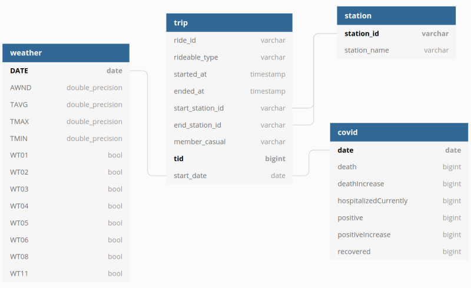

# DEND - Capstone Project

Jun Zhu
___

**Table of contents:**
1. Scope the project and gather data
2. Explore and access the data
3. Define the data model
4. Run ETL to model the data
5. Reflection


## Step 1: Scope the project and gather data


### Introduction

[Capital Bikeshare](https://www.capitalbikeshare.com/) is a metro DC's 
bikeshare service in the US, with thousands of bikes and hundreds of stations 
across 7 jurisdictions: Washington, DC.; Arlington, VA; Alexandria, VA; 
Montgomery, MD; Prince George's County, MD; Fairfax County, VA; and the City 
of Falls Church, VA. Designed for quick trips with convenience in mind, 
it’s a fun and affordable way to get around. 

In order to make a data-science driven business, it is critical to be able to answer 
questions like where do riders go? When do they ride? How far do they go? 
Which stations are most popular? What days of the week are most rides taken on? 
How does the weather affect the activities of riders. Last but not least, 
it would also be interesting to know how did the Coronavirus pandemic affect 
the business during the past two years.

### Datasets

#### Captial Bikeshare trip data

Capital Bikeshare provides all the 
[trip data](https://s3.amazonaws.com/capitalbikeshare-data/index.html) in **CSV**
format that allow to answer the above questions.

Total number of records: **9,431,284**

#### Covid data

The [COVID Tracking project](https://covidtracking.com/) collects, 
cross-checks, and publishes COVID-19 data from 56 US states and territories 
in three main areas: testing, hospitalization, and patient outcomes, 
racial and ethnic demographic information via The COVID Racial Data Tracker, 
and long-term-care facilities via the Long-Term-Care tracker.

The capstone project uses `Historic values for all states` **JSON** data 
downloaded from the [data API](https://covidtracking.com/data/api). 
Descriptions of the data fields can also be found there.

Total number of records: **20,780**

#### Weather data

The weather data is from [NOAA](https://www.ncdc.noaa.gov/cdo-web/). I ordered
daily observation data since 1.1.2018 from more than 100 weather stations in 
Washington DC. The data is in **CSV** format. 

Total number of records: **128,579**


## Step 2: Explore and access the data

Details can be found in the Jupyter notebook 
[workspace/data_exploration.ipynb](workspace/data_exploration.ipynb).

#### Setting up a Spark cluster locally (optional)

Check the Docker Compose file [here](../dev_envs/spark_docker). Remember to change
the `WORKSPACE` in the [env](../dev_envs/spark_docker/.env) file to the `workspace`
in the current directory.


## Step 3: Define the data model

A star schema was chosen in this project. The trip data is essential to the
business and thus the `trip` table is the fact table. Two of the dimension tables, 
`covid` table and `weather` table, could contain important information which 
acounts for the daily fluctuation of the business. Another dimension table,
`station` table, could also help since addresses of stations do matter.




### Fact table

|Field Name|Description|
|---|---|
|ride_id|Ride ID (only available after 2020.05)|
|rideable_type|Rideable type (only available after 2020.05)|
|started_at|Start time of the trip|
|ended_at|End time of the trip|
|start_station_id|Start station ID|
|end_station_id|End station ID|
|member_casual|Customer type (member or casual)|
|tid|Unique trip ID|
|start_date|Start date of the trip|

### Dimension tables

#### Station table

|Field Name|Description|
|---|---|
|station_id|Station ID|
|station_name|Station name (address)|

#### Covid table

|Field Name|Description|
|---|---|
|date|Date on which data was collected by The COVID Tracking Project|
|deathIncrease|Daily increase in death, calculated from the previous day’s value|
|hospitalizedCurrently|Individuals who are currently hospitalized with COVID-19|
|positive|Total number of confirmed plus probable cases of COVID-19 reported by the state or territory|
|positiveIncrease|The daily increase in API field positive, which measures Cases (confirmed plus probable) calculated based on the previous day’s value|
|recovered|Total number of people that are identified as recovered from COVID-19|

#### Weather table

|Field Name|Description|
|---|---|
|DATE|Date of the record|
|AWND|Average daily wind speed (meters per second)|
|TAVG|Average of hourly values|
|TMAX|Highest hourly temperature|
|TMIN|Lowest hourly temperature|
|WT01|Fog, ice fog, or freezing fog (may include heavy fog)|
|WT02|Heavy fog or heaving freezing fog (not always distinguished from fog)|
|WT03|Thunder|
|WT04|Ice pellets, sleet, snow pellets, or small hail|
|WT05|Hail (may include small hail)|
|WT06|Glaze or rime|
|WT08|Smoke or haze|
|WT11|High or damaging winds|


## Step 4: Run ETL to model the data

### Test on a standalone Spark cluster locally (optional)

You will need a local spark cluster mentioned in step 2.
```sh
sudo docker build -t capstone-project-spark-cluster .

sudo docker run --network spark_docker_default -v ${PWD}/etl:/app/ \
                -v ${PWD}/workspace:/opt/workspace --rm \
                -it capstone-project-spark-cluster /bin/bash
spark-submit --master spark://spark-master:7077 etl.py --local
```

### Copy datasets to S3

```sh
aws s3 cp --recursive ./datasets s3://dend-capstone-project-workspace/datasets/
```

### Start an EMR cluster

```sh
cd etl
./start_emr_cluster.sh

# Copy the file to the cluster.
scp -i ~/spark_emr.pem etl.py hadoop@<MasterPublicDnsName>:~/

# Run job
ssh -i ~/spark_emr.pem hadoop@<MasterPublicDnsName>
PYSPARK_PYTHON=/usr/bin/python3 spark-submit etl/etl.py
```
For more details, check [here](../data_lake_with_spark).

### Start an AWS Redshift cluster and create tables

```sh
python redshift/start_db_on_redshift.py
```

### Run Apache Airflow in Docker

Copy the [Docker Compose file](../dev_envs/airflow_docker/docker-compose.yaml)
into the `airflow` directory and start Airflow server by
```sh
cd airflow
docker-compose up
```


There are two types of data checks:

- Check the data count in each table
- Check the date range in the trip table

**Caveat**: debug errors when copying from S3 to Redshift:
```sql
select message from SVL_S3LOG where query = <query id>
```

**Note**: *Due to the cost reason, I did not add the Spark part into the Airflow.
Otherwise, I have to run both EMR cluster nd Redshift cluster at the same time 
for testing and debugging.*

Finally, it is recommended to run the pipeline on a daily basis on the new data.

## Step 5: Reflection

- *What if the data was increased by 100x?*

The total amount of data used in this project is about 1.4 GB. It will be 140 GB
when the amount is increased by 100 times. However, Redshift allows to run 
complex analytic queries against terabytes to petabytes of structured and 
semi-structured data. For more details, please check https://aws.amazon.com/redshift/faqs/.

- *What if the data populates a dashboard that must be updated on a daily basis 
  by 7am every day?*
  
The pipeline can be triggered by Airflow with different time schedules.

- *What if the database needed to be accessed by 100+ people?*

AWS Redshift allows a max of 500 connections and 50 concurrencies per cluster. For
more details, please check
https://docs.aws.amazon.com/redshift/latest/mgmt/amazon-redshift-limits.html.

Alternatively, if users do not need to perform insert and update, and they only 
need to access some queries, then the data can be periodically copied to a NoSQL 
server such as Cassandra.
