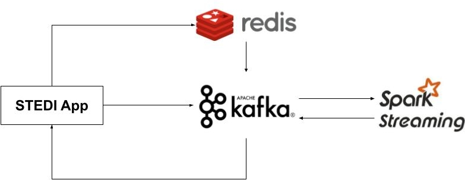

# Evaluate Human Balance with Spark Streaming

Jun Zhu
___

A small startup STEDI focuses on assessing balance of seniors. STEDI has 
an application that collects data from seniors during a small exercise. 
In this application, the user starts a timer and clicks a button with each step 
he/she takes. The test is finished when 30 steps are reached. The data 
collected enables the application to monitor the balance risk of the user. 



Redis is configured as a Kafka source. Whenever any data is saved to Redis, 
the message will be published to the Kafka topic called `redis-server`. After a 
customer has completed 4 or more assessments, the risk score will be 
transmitted to a Kafka topic called `stedi-events`. 

## Start the Spark ecosystem with Kafka and Redis

```
docker-compose up
```

List the existing Kafka topics by

```sh
docker exec broker kafka-topics --bootstrap-server localhost:9092 --list
```

If all the services started correctly, you should be able to see the following
list of topics:
```
__confluent.support.metrics
__consumer_offsets
redis-server
stedi-events
```

## How to use STEDI

- Log in to the STEDI application: http://localhost:4567.

### Automatic data generation

- From the timer page, use the toggle button in the upper right corner to 
  activate simulated user data. One can create additional customers for by
  toggling off and on the button. Each time you activate it, STEDI creates 
  30 new customers, and then starts generating the risk scores for each one. 
  It takes about 4 minutes for each customer to have the risk scores generated, 
  however customer data is generated and published to Redis immediately.

### Manual data generation (to be verified)

- Click Create New Customer, create a test customer and submit.
- Click start, then add steps until you reach 30 and the timer has stopped.
- Repeat this three times, and you will receive a risk score.


## Monitor data

### Redis

Start the Redis CLI tool by

```
docker exec -it redis redis-cli
```

List the existing keys by
```sh
keys **
```

The following keys are already in Redis:
```sh
1) "LoginToken"
2) "Customer"
3) "RapidStepTest"
4) "User"
```

The types for all the keys are `zset`. One can check the data, for example, by
```
zrange RapidStepTest 0 -1
```

### STEDI

Monitor the progress of data generation in STEDI by

```
docker logs -f stedi
```

Perform EDA on the two Kafka topics separately by

```
bash submit-event-kafka-stream.sh
bash submit-redis-kafka-stream.sh
```

## Process data

```
bash submit-kafka-join.sh
```

Once the data is populated in the configured kafka topic, the graph should have 
real-time data points.
